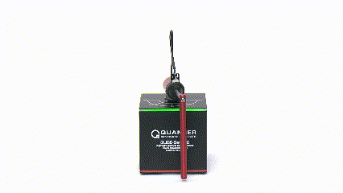
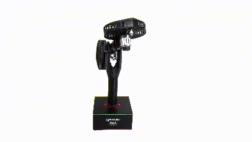

# Model Predictive Controllers with Intelligent Optimizers (WIP 6/17/2022, Defense 12/2022)
## Introduction
This repo is home to all the Model Predictive Control (MPC) algorithms proposed 
in my thesis.  

Here you'll find simulated control system examples for:
- Oscillating masses (linear)
- Inverted double pendulum  (no linearization techniques)

And physical control system examples for:
- Inverted single pendulum ([Quanser QUBE](https://www.quanser.com/products/qube-servo-2/))
- Dual rotor ([Quanser AERO](https://www.quanser.com/products/aero-2/))  

### General concept for the noobs (and my parents)
[Model Predictive Control](https://en.wikipedia.org/wiki/Model_predictive_control) is
a technique engineers use to automatically manipulate a system, such as an airplane, a 
motor, an electronic circuit, or even the economy.
MPC is awesome, but it can be a little slow, especially when deployed on
small hardware like a drone. MPC is a __controller__ that tries to look into the future and guess the
best path to take, while adhering to all the crap engineers need robots 
and cars to do these days at the same time. _"Don't run that kid over"_ is one of the things you can tell an MPC,
which is generally *very* complicated in other control frameworks.
  
The research you'll find here is an investigation into the fusion of AI and MPC to address
how slow it can be. I'm guessing that an AI will respond
more quickly, but at the cost of tracking accuracy and other 
performance metrics. There will be trade-offs, and it's a pain in the butt to build right now.
Some methods are out there to make MPC much faster, such as 
[Explicit MPC](https://en.wikipedia.org/wiki/Model_predictive_control#Explicit_MPC),
which are much, _much_, easier to build with modern tools like MATLAB. However, they aren't based on AI,
and AI is really cool. And I need a master’s degree. 

To understand this research, you have to understand a bit about the different types of AI and what they can do.
The best introductory text to this topic can be found [here](http://neuralnetworksanddeeplearning.com/)
for free, and if you hate textbooks like I used to, then check out [this YouTube series](https://www.youtube.com/watch?v=aircAruvnKk)
that basically convinces you to be a data scientist in under 20 minutes.  

## The project

### Cool gifs here
Oscillating masses example (from [do-mpc](https://www.do-mpc.com/en/latest/getting_started.html)).
I modeled it basically just so that I could show this animation.  

  

The QUBE  

  

The AERO 2  

  

## Requirements
- MATLAB R2022a
- Model Predictive Control Toolbox

## Usage
If you have the software pre-requisites, you can run the algorithm manually by executing main.m after adding this repo to your MATLAB path

## Results
Crossing my fingers this thing works
## Related Work
Key reference papers from the thesis:  
[[1]](https://arxiv.org/abs/1806.04167) This guy did something kinda similar but mostly presented a statistical way to re-train your controller if it sucks
[[2]](https://www.sciencedirect.com/science/article/pii/S0967066116302970?via%3Dihub)
From the folks at do-mpc
